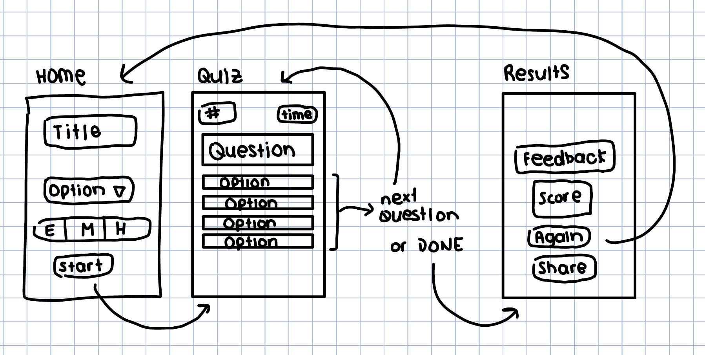

# Trivia App Project Proposal
By Paloma Pichardo

## Functionality
1. Home screen: user can select a quiz category and difficulty
2. Quiz screen: displays questions one at a time with multiple choice answers, timer per question
3. Results screen: shows final score with feedback message
4. Potential extra features (if time):
   1. User collects streak bonuses, which increase the score as a reward for getting consecutive questions correctly
   2. Learn mode: repeats missed questions until all questions are answered correctly at least once. Separate from quiz mode.
   3. Share Results: a share button on the results screen triggers iOS's native share sheet, allowing users to send their score to friends over iMessage, copy it to their clipboard, or share it to other apps. Full Messages functionality would best be verified on a physical device.

Wireframe:

## Tech Stack
- Language: Swift, modern programming language for iOS development
- UI Framework: UIKit, uses ViewControllers to manage each screen
- Networking: URLSession, Apple's built-in tool for making HTTP requests to external APIs
- Data Parsing: Codable, Swift's built-in system for converting JSON responses into Swift objects
- API: Open Trivia Database (opentdb.com), returns trivia questions by category and difficulty
- Architecture: MVC (Model-View-Controller), standard iOS design pattern
- Testing: XCTest, Apple's built-in testing framework, used for unit and integration tests

## Components

### Model: Question struct, QuizManager class
- Question struct represents a single trivia question and stores the question text, the list of possible answers, and the correct answer
- QuizManager class tracks the current score and which question number they're on, handles fetching

### Networking: APIService
- Fetches from Open Trivia DB using URLSession
- Uses Codable to decode JSON automatically into Question objects

### Controllers: each screen is handled by a subclass of UIViewController
- HomeViewController: handles category and difficulty selection
- QuizViewController: displays questions one at a time, manages the countdown timer, updates score
- ResultsViewController: receives final score, displays a feedback message to the user

## Potential Issues
1. Unexpected characters in API response, such as HTML codes: may need an extra decoding step before displaying text information
2. Zero Swift experience; learning curve may be more than expected: will manage this risk by reading documentation beforehand and prioritizing core features first
